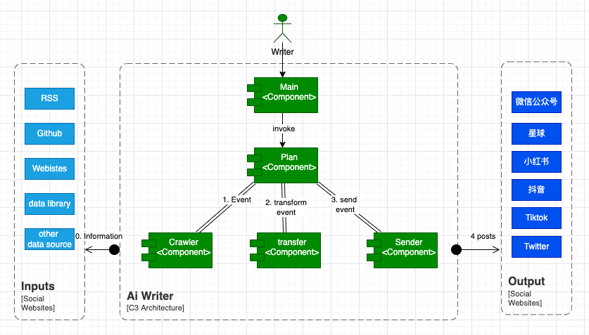

# 关于未来LLM AI应用的思考，以及从0到1实现LLM资料分析。

以下内容由作者在从0到1学习大家LLM（大语言数据模型）的过程当中收集而来，仅供参考和传播学习，如有涉及版权问题，请联系作者删除。

## 当前企业级基于OpenAI应用实施担心的问题

* 调用chatgpt openAI的接口贵
* 网络传输慢
* 信息安全泄露风险

## 畅想不久的将来基于LLM的AI应用的样子

* 首先，我们一定有一种新的职业，他（他）们叫 Prompt 提示工程师，在创作性行业尤其更是如此，并且已经存在我们的身边
* 未来的LLM AI应用，应该具备和Prompt交互的能力，并自我不断成长，给用户提供更好的服务和能力
* 未来的LLM AI应用，他应该具备动态学习的能力，不断从身边环境学习新的概念和知识，这方面，基于Langchain的AutoGPT已经初露拳脚
* 未来的LLM AI应用，它会在自己的专业领域拥有自己独特的数据模型，这也是产品的核心竞争力之一。 而要达到这样的目标，那么训练自己的大语言模型就是趋势了！

## 关于软件行业Prompt能力的探索

### 语言
| Lanuage | project |  贡献者 |
| :---: | :---: | :---: |
| Java | https://github.com/chatgpt-community/prompt-springboot | Marvin |
| React | https://github.com/chatgpt-community/prompt-react | yuqi | 
| Python | https://github.com/chatgpt-community/prompt-python | marvin | 
| Android | https://github.com/GPT-Coding/prompt-chain-android  | jingtian mo | 
| devops | https://github.com/GPT-Coding/prompt-chain-devops | baorui zhang | 

### 利用ChatGPT开发案例
| Lanuage | project |  贡献者 |
| :---: | :---: | :---: |
| python, vscode插件 | https://github.com/chatgpt-community/prompt-vscode-plugin | yuqi&Marvin |
| python, spider爬虫 | https://github.com/chatgpt-community/chatgpt-gpt3demo-spider | sihan |
| python, wechat公众号 | https://github.com/chatgpt-community/chatgpt-wechat-sender | marivn |
| python, 星球 | https://github.com/chatgpt-community/chatgpt-xinqiu-sender | marivn |

### 开源项目 AiWriter

https://github.com/chatgpt-community/aiwriter (by sihan&marvin)

## 如何训练自己的LLM模型 - 资料分享

### 🧐 了解基本概念和整体思路

* https://juejin.cn/s/%E8%85%BE%E8%AE%AF%E4%BA%91%20git%20clone%20%E6%85%A2
* https://www.bmpi.dev/dev/deep-learning/nlp-language-models/
* https://developer.m1amdocs.com/
* https://innovationfeel.com/blog/top-6-auth0-alternatives-the-most-optimized-ways-for-securing-your-app
* https://www.baeldung.com/multitenancy-with-spring-data-jpa
* https://developer.m1amdocs.com/documentation/Content/B-Getting%20Started/MarketONE/MarketONEOpportunity.htm
* https://github.com/WangRongsheng
* https://github.com/unit-mesh/unit-minions
* https://github.com/amplia-iiot/vuepress-theme-openapi

### 🧐 学习llama基础

* https://developer.aliyun.com/article/1204338
* https://juejin.cn/post/7216248612446240829
* https://finance.sina.com.cn/tech/roll/2023-03-26/doc-imynemwf9000026.shtml
* https://getimg.ai/text-to-image
* https://sapling.ai/llm/alpaca-vs-llama
* https://replicate.notion.site/Creating-a-80GB-A100-instance-on-Google-Cloud-30a9243014d04851b339a6b78790cb25

### 🧐 开源LLM模型

https://huggingface.co/medalpaca
https://modelscope.cn/models
https://github.com/CVI-SZU/Linly
https://huggingface.co/decapoda-research/llama-7b-hf
https://github.com/ymcui/Chinese-LLaMA-Alpaca
https://bair.berkeley.edu/blog/2023/04/03/koala/
https://github.com/OpenBuddy/OpenBuddy/blob/main/README.zh.md
https://github.com/brightmart/nlp_chinese_corpus#5%E7%BF%BB%E8%AF%91%E8%AF%AD%E6%96%99translation2019zh
https://lmsys.org/blog/2023-03-30-vicuna/
https://github.com/google-research/bert

### 🧐 开源数据集分享

https://github.com/tatsu-lab/stanford_alpaca/blob/main/alpaca_data.json
https://huggingface.co/datasets
https://zhuanlan.zhihu.com/p/355117358
https://github.com/tatsu-lab/stanford_alpaca
https://github.com/ymcui/Chinese-LLaMA-Alpaca/tree/main/data
https://github.com/dbiir/UER-py/wiki/Pretraining-data

### 🧐 LLM model fine-tuneing 模型微调

https://github.com/22-hours/cabrita
https://github.com/Tencent/TencentPretrain/blob/main/README_ZH.md
https://github.com/dbiir/UER-py/blob/master/README_ZH.md
https://github.com/tloen/alpaca-lora

### 🧐 模型本地化部署和运行

https://orcaterm.cloud.tencent.com/terminal?instanceId=ins-ca0j5xvm&region=ap-guangzhou&regionId=1&source=cvm&from=cvm_console_login_btn
https://github.com/ggerganov/llama.cpp
https://github.com/antimatter15/alpaca.cpp
https://github.com/cocktailpeanut/dalai
https://chat.lmsys.org/?model=koala-13b
https://github.com/CLUEbenchmark/pCLUE
https://huggingface.co/spaces/tloen/alpaca-lora
https://console.cloud.tencent.com/message/detail/1286047964

### 🧐 模型评估

https://wqw547243068.github.io/chatgpt_mimic

## 总结

学习LLM大语言模型AI应用生态是一件非常有意思和挑战性的事情，有人说这是新的风口，其实这股风已经刮起了很久，只是缺少了你的参与。

让我们保持开放包容，客观严谨的态度去学习，创作，并应用

如果你有兴趣持续性学习和研究，欢迎私信我，我们一同交流分享学习！